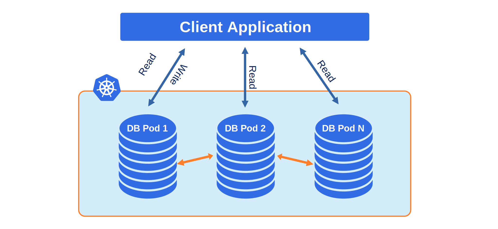
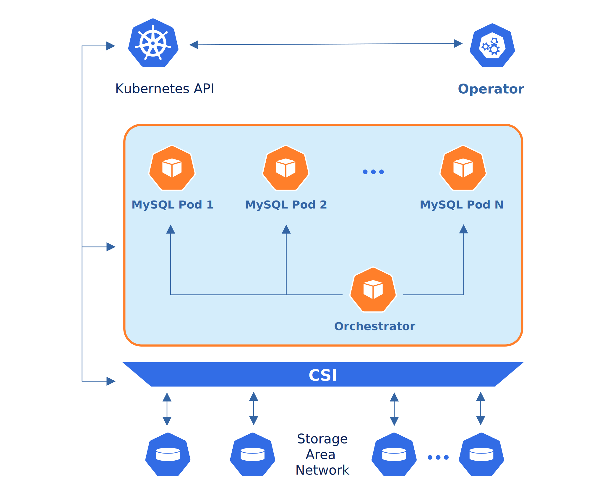

# Design overview

The Percona Operator for MySQL automates and simplifies deploying
and managing open source MySQL clusters on Kubernetes.

Containers deployed with the Operator include the following components:

* [Percona Server for MySQL](https://www.percona.com/doc/percona-server/LATEST/index.html) (a free, fully compatible, enhanced, and open source drop-in replacement for any MySQL database),

* [Percona XtraBackup](https://www.percona.com/doc/percona-xtrabackup/8.0/index.html) (a hot backup utility for MySQL based servers that doesn’t lock your database during the backup),

* [Orchestrator](https://github.com/openark/orchestrator) (a replication topology manager for MySQL, used when [asynchronous replication](https://dev.mysql.com/doc/refman/8.0/en/group-replication-primary-secondary-replication.html) betweem MySQL instances [is turned on](operator.md#mysql-clustertype)),

* [MySQL Router](https://dev.mysql.com/doc/mysql-router/8.0/en/), a proxy solution used when [group replication](https://dev.mysql.com/doc/refman/8.0/en/group-replication.html) between MySQL instances [is turned on](operator.md#mysql-clustertype)).

The design of the Operator is highly bound
to Percona Server for MySQL and the high availability implementation based on Orchestrator,
which in its turn can be briefly described with the following diagram.

Being a regular MySQL Server instance, each node contains the same set
of data synchronized accross nodes. The recommended configuration is to
have at least 3 nodes. In a basic setup with this amount of nodes,
Percona Server for MySQL provides high availability, continuing to
function if you take any of the nodes down.

To provide high availability operator uses [node affinity](https://kubernetes.io/docs/concepts/configuration/assign-pod-node/#affinity-and-anti-affinity)
to run Percona Server for MySQL instances on separate worker nodes if possible. If
some node fails, the pod with it is automatically re-created on another node.

To provide data storage for stateful applications, Kubernetes uses
Persistent Volumes. A *PersistentVolumeClaim* (PVC) is used to implement
the automatic storage provisioning to pods. If a failure occurs, the
Container Storage Interface (CSI) should be able to re-mount storage on
a different node. The PVC StorageClass must support this feature
(Kubernetes and OpenShift support this in versions 1.9 and 3.9
respectively).

The Operator functionality extends the Kubernetes API with
*PerconaServerForMySQL* object, and it is implemented as a golang
application. Each *PerconaServerForMySQL* object maps to one separate MySQL setup.
The Operator listens to all events on the created objects.
When a new PerconaServerForMySQL object is created, or an existing one undergoes
some changes or deletion, the Operator automatically
creates/changes/deletes all needed Kubernetes objects with the
appropriate settings to provide a proper Percona Server for MySQL operation.
