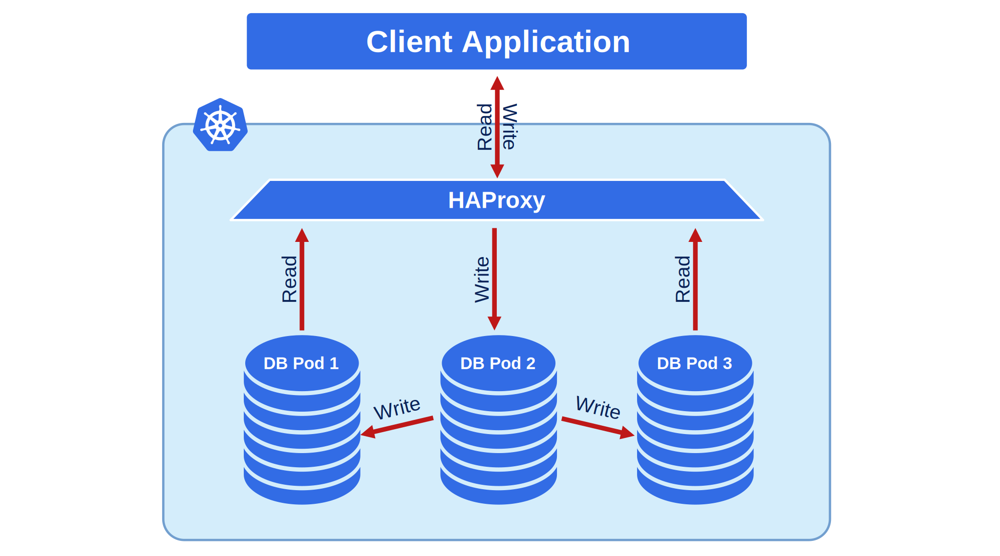
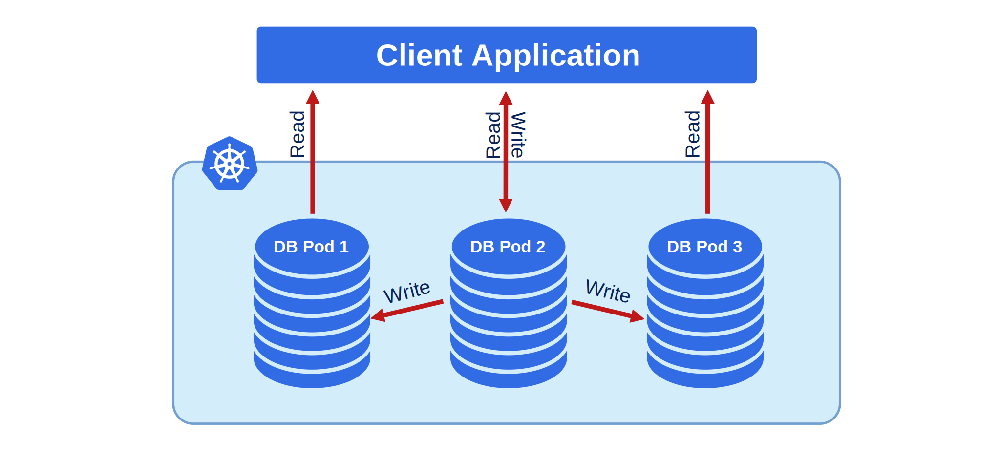

# Exposing cluster

The Operator provides entry points for accessing the database by client
applications in several scenarios. In either way the cluster is exposed with
regular Kubernetes [Service objects](https://kubernetes.io/docs/concepts/services-networking/service/),
configured by the Operator.

This document describes the usage of [Custom Resource manifest options](operator.md#operator-custom-resource-options)
to expose the clusters deployed with the Operator. The expose options vary for
different replication types: [Asynchronous](https://dev.mysql.com/doc/refman/8.0/en/replication.html)
and [Group Replication](https://dev.mysql.com/doc/refman/8.0/en/group-replication.html).

## Asynchronous Replication

### Exposing cluster with HAProxy

Percona Operator for MySQL provides load balancing and proxy service with
[HAProxy](https://haproxy.org) (enabled by default).



You can control whether to use it or not by enabling or disabling it via the
`haproxy.enabled` option in the `deploy/cr.yaml` configuration file.

The following example turns on the asynchronous replication and enables HAProxy:

```yaml
mysql:
  clusterType: async
  ...
  haproxy: 
   enabled: true
   size: 3
   image: perconalab/percona-xtradb-cluster-operator:{{ release }}-haproxy
```

The resulting HAProxy setup will contain the `cluster1-haproxy` service
listening on ports 3306 (MySQL primary), 3307 (MySQL replicas), and 3309 (the [proxy protocol](https://www.haproxy.com/blog/haproxy/proxy-protocol/)
useful for operations such as asynchronous calls).

!!! note

    The Operator currently supports using HAProxy with the asyncrhonous cluster
    only, and therefore simultaneous enabling of both HAProxy and Group
    Replication is not possible.

When the cluster is configured in this way, you can find the endpoint (the
public IP address of the load balancer in our example) by getting the Service
object with the `kubectl get service` command:

```{.bash data-prompt="$"}
$ kubectl get service cluster1-haproxy
NAME               TYPE        CLUSTER-IP    EXTERNAL-IP   PORT(S)                      AGE
cluster1-haproxy   ClusterIP   10.76.2.102   <none>        3306/TCP,3307/TCP,3309/TCP   2m32s
```

### Exposing cluster without HAProxy

With [Asynchronous or Semi-synchronous replication](https://dev.mysql.com/doc/refman/8.0/en/group-replication-primary-secondary-replication.html)
the cluster can be also exposed through a Kubernetes Service called
`<CLUSTER_NAME>-mysql-primary`: for example, `cluster1-mysql-primary`.


This Service is created by default and is always present. You can change the
type of the Service object by setting [mysql.primaryServiceType](operator.md#mysql-primaryservicetype)
variable in the Custom Resource.

The following example exposes the Primary node of the asynchronous cluster with
the LoadBalancer object:

```yaml
mysql:
  clusterType: async
  ...
  primaryServiceType: LoadBalancer
```

When the cluster is configured in this way, you can find the endpoint (the
public IP address of the load balancer in our example) by getting the Service
object with the `kubectl get service` command:

```{.bash data-prompt="$"}
$ kubectl get service cluster1-mysql-primary
NAME                     TYPE           CLUSTER-IP     EXTERNAL-IP     PORT(S)                                                         AGE
cluster1-mysql-primary   LoadBalancer   10.40.37.98    35.192.172.85   3306:32146/TCP,33062:31062/TCP,33060:32026/TCP,6033:30521/TCP   3m31s
```

As you could notice, this command also shows mapped ports the application can
use to communicate with MySQL primary instance (e.g. `3306` for the classic
MySQL protocol, or `33060` for [MySQL X Protocol](https://dev.mysql.com/doc/dev/mysql-server/latest/page_mysqlx_protocol.html)
useful for operations such as asynchronous calls).

## Group Replication

Clusters configured to use Group Replication are exposed via the [MySQL Router](https://dev.mysql.com/doc/mysql-router/8.0/en/)
through a Kubernetes Service called `<CLUSTER_NAME>-router`: for example,
`cluster1-router`. Network design in this case looks like this:


MySQL Router can be configured via the [router section](operator.md#operator-router-section).
In particular, the [router.expose.type](operator.md#router-expose-type) option sets the
type of the correspondent Kubernetes Service object. The following example
exposes MySQL Router through a LoadBalancer object:

```yaml
mysql:
  clusterType: group-replication
  ...
router:
  expose:
    type: LoadBalancer
```

When the cluster is configured in this way, you can find the endpoint (the
public IP address of the load balancer in our example) by getting the Service
object with the `kubectl get service` command:

```{.bash data-prompt="$"}
$ kubectl get service cluster1-router
NAME                TYPE           CLUSTER-IP    EXTERNAL-IP     PORT(S)                                                       AGE
my-cluster-router   LoadBalancer   10.20.22.90   35.223.42.238   6446:30852/TCP,6447:31694/TCP,6448:31515/TCP,6449:31686/TCP   18h
```

As you could notice, this command also shows mapped ports the application can
use to communicate with MySQL Router:

* `3306` - read/write, default MySQL clients connection,
* `33062` - read/write, port for MySQL administrative connections,
* `6446` - read/write, routing traffic to a Primary node,
* `6447` - read-only, load balancing the traffic across Replicas.

Additionally, ports `6448` and `6449` are available in the same way to
connect via [MySQL X Protocol](https://dev.mysql.com/doc/dev/mysql-server/latest/page_mysqlx_protocol.html)
useful for operations such as asynchronous calls.

Alternatively, you can find the endpoint to connect to by `kubectl get ps`
command:

```{.bash data-prompt="$"}
$ kubectl get ps
NAME       REPLICATION         ENDPOINT        STATE   AGE
cluster1   group-replication   35.239.63.143   ready   10m
```

## Service per Pod

Still, sometimes it is required to expose all MySQL instances, where each of
them gets its own IP address (e.g. in case of load balancing implemented on the
application level).



This is possible by setting the following options in [spec.mysql section](operator.md#operator-mysql-section).

* [mysql.expose.enabled](operator.md#mysql-expose-enabled) enables or disables exposure
    of MySQL instances,
* [mysql.expose.type](operator.md#mysql-expose-type) defines the Kubernetes Service
    object type.

The following example creates a dedicated LoadBalancer Service for each node of
the MySQL cluster:

```yaml
mysql:
  expose:
    enabled: true
    type: LoadBalancer
```

When the cluster instances are exposed in this way, you can find the
corresponding Services with the `kubectl get services` command:

```{.bash data-prompt="$"}
$ kubectl get services
NAME                     TYPE           CLUSTER-IP     EXTERNAL-IP     PORT(S)                                                         AGE
...
cluster1-mysql-0         LoadBalancer   10.40.44.110   104.198.16.21   3306:31009/TCP,33062:31319/TCP,33060:30737/TCP,6033:30660/TCP   75s
cluster1-mysql-1         LoadBalancer   10.40.42.5     34.70.170.187   3306:30601/TCP,33062:30273/TCP,33060:30910/TCP,6033:30847/TCP   75s
cluster1-mysql-2         LoadBalancer   10.40.42.158   35.193.50.44    3306:32042/TCP,33062:31576/TCP,33060:31656/TCP,6033:31448/TCP   75s
```

As you could notice, this command also shows mapped ports the application can
use to communicate with MySQL instances (e.g. `3306` for the classic MySQL
protocol, or `33060` for [MySQL X Protocol](https://dev.mysql.com/doc/dev/mysql-server/latest/page_mysqlx_protocol.html)
useful for operations such as asynchronous calls).
